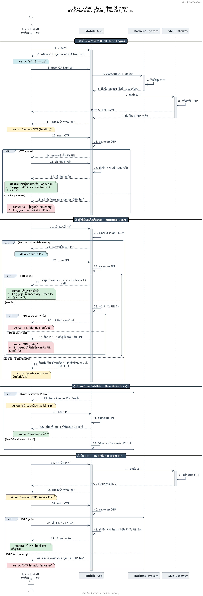

# sequence-tbc — Skill วาด Sequence Diagram มาตรฐาน TBC

Skill ช่วยทีม **Dev / PM / BA** สร้าง Sequence Diagram มาตรฐานบริษัท ที่ Business อ่านเข้าใจและ Dev นำไปพัฒนาต่อได้

## ติดตั้ง Skill
skill นี้อยู่ในโฟลเดอร์ `Skill/sequence-tbc/` ของรีโป ติดตั้งโดย clone แล้ว link เข้า Claude Code:

```bash
git clone https://github.com/Suppawit-biz/Claude-Skills.git ~/claude-skills
ln -s ~/claude-skills/Skill/sequence-tbc ~/.claude/skills/sequence-tbc
```

(หรือกด **Download ZIP** แล้วคัดลอกโฟลเดอร์ `Skill/sequence-tbc` ไปไว้ที่ `~/.claude/skills/sequence-tbc/`)

แล้วเรียกใช้ใน Claude Code โดยพิมพ์ **`/sequence-tbc`** หรือพูดลอย ๆ เช่น *"ช่วยวาด sequence diagram flow สมัครสมาชิกให้หน่อย"*

## ก่อนใช้ครั้งแรก
ต้องมี **Java** + **VS Code extension `jebbs.plantuml`** — ดู [references/install-guide.md](references/install-guide.md)
(Skill จะพาติดตั้งให้เองถ้ายังไม่มี)

## ผลลัพธ์: 1 ไดอะแกรม = 2 ไฟล์
- `[ชื่อ].puml` — รูป flow สะอาด ๆ (render เป็น PNG/SVG/PDF)
- `[ชื่อ].md` — คำอธิบายแยก (ข้อมูลเอกสาร + Status Legend + สรุปช่วง + เงื่อนไข)

## โครงสร้าง
| ไฟล์ | ใช้ทำอะไร |
|---|---|
| `SKILL.md` | หัวใจ — เมื่อไหร่ใช้ + ขั้นตอนสัมภาษณ์ + workflow |
| `references/install-guide.md` | ขั้นตอนติดตั้ง + แก้ปัญหา |
| `references/conventions.md` | กติกาการวาดของบริษัท + checklist |
| `references/plantuml-cheatsheet.md` | syntax ที่ใช้บ่อย |
| `assets/tbc-theme.puml` | ธีมกลาง (วาง inline บนสุดทุกไฟล์) |
| `templates/sequence-template.puml` | โครงรูปเปล่าพร้อมทุกองค์ประกอบ |
| `templates/description-template.md` | โครงไฟล์คำอธิบายเปล่า |
| `examples/mobile-login-flow.*` | ตัวอย่างครบชุด (`.puml` `.md` `.png` `.svg`) |
| `scripts/render.sh` | export PNG + SVG + เปิดทำ PDF |

## Export
```bash
bash scripts/render.sh                    # ทุกไฟล์ → PNG + SVG ใน exported/
bash scripts/render.sh --pdf myflow.puml  # เปิด SVG ใน browser เพื่อ Print to PDF
```

---

## 🖼️ ตัวอย่างผลลัพธ์
ไดอะแกรมตัวอย่าง (Mobile App — Login Flow) ที่สร้างด้วย skill นี้:

<p align="center">
  
</p>

> ดูไฟล์เต็ม: [.puml](examples/mobile-login-flow.puml) · [.md (คำอธิบาย)](examples/mobile-login-flow.md) · [.svg (คมชัด)](examples/mobile-login-flow.svg)
